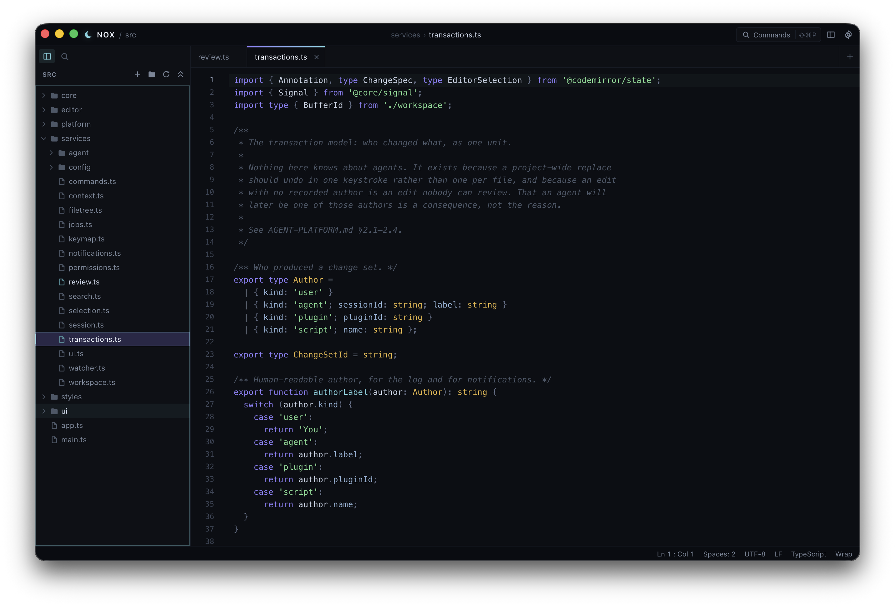
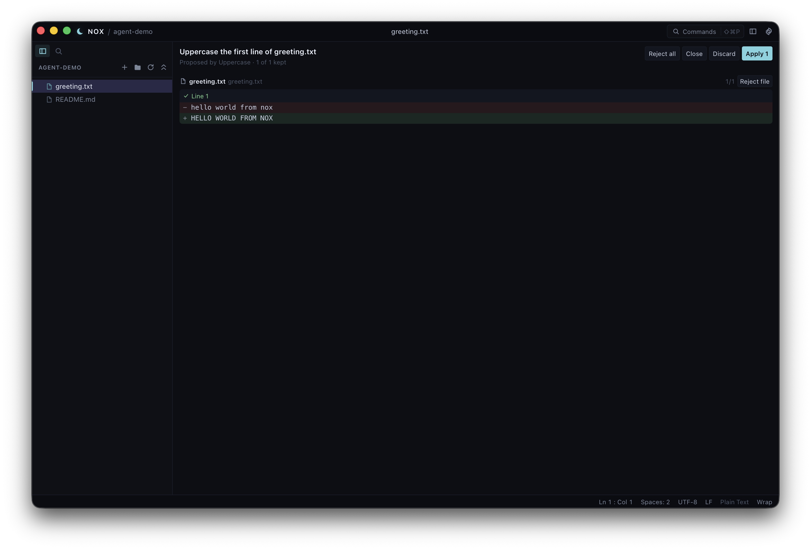

<div align="center">

# Nox

**A fast, dark, keyboard-first text editor.**

*Nox* is Latin for *night*.

[](https://github.com/francescoa27122/nox-editor/actions/workflows/ci.yml)

[Try it](#try-it) · [What makes it different](#what-makes-it-different) · [Under the hood](#under-the-hood)

</div>

<!-- SCREENSHOT: hero -->


---

Nox is a text editor built around one idea: the editor should feel like a
command center, not a document viewer. Dark, quiet, keyboard-driven, and quick
enough that you stop noticing it.

It is **not** a VS Code clone. It has its own design language, its own
shortcuts where they can be better, and a deliberately small surface area. It
is also about 4 MB, and starts instantly.

I built it because I wanted to know what an editor looks like if you take two
things seriously from the first line of code: **never losing someone's work**,
and **letting a program help you edit without ever letting it edit behind your
back.**

## Try it

**Download it** from the [latest release](https://github.com/francescoa27122/nox-editor/releases/latest).
macOS, Windows and Linux all have builds: take the `.dmg` for your Mac's
chip, the `-setup.exe` on Windows, or the `.deb` or `.rpm` on Linux.

Nox is not signed with a paid certificate on either platform that asks for
one, so both interrupt the first run. Neither means the download is broken.

On **Windows**, SmartScreen says *"Windows protected your PC"* — choose
**More info**, then **Run anyway**.

On **macOS**, drag Nox to Applications and run this once:

```bash
xattr -dr com.apple.quarantine /Applications/Nox.app
```

You will need that command. Nox is ad-hoc signed rather than signed with an
Apple Developer ID, so macOS quarantines it on download and claims it is
*"damaged"*. That sounds like a corrupt download, but the file is fine.

Linux packages are built on Ubuntu 22.04, so they need glibc 2.35 or newer.
There is no AppImage.

### Or build it

If there's no build for your platform, or you'd rather not run that command,
build from source. It's the same thing, from code you can read. You need
[Node 20+](https://nodejs.org), [Rust](https://rustup.rs), and your
platform's [Tauri prerequisites](https://tauri.app/start/prerequisites/).

```bash
git clone https://github.com/francescoa27122/nox-editor.git
cd nox-editor
npm install
npm run app
```

The first run compiles the Rust side and takes a few minutes. After that it
starts in seconds.

**Just want a look?** `npm run dev` opens Nox in your browser against a small
demo project. No Rust build, and nothing touches your disk.

## What makes it different

### It does not lose your work. Ever.

Close the window with unsaved changes and Nox does not ask you a question. It
keeps them, and hands them back next time you open it, still unsaved and still
undoable back to what is on disk.

A dialog can be answered wrong at 2am. Persistence cannot.

Saving writes to a temporary file and renames it into place, so a crash or a
full disk part way through can't leave you with half a file. If something else
changes a file while you have it open, Nox tells you instead of quietly picking
a winner.

### Undo works across files

Run a project-wide find-and-replace across forty files, then press
<kbd>⌘Z</kbd> **once**. The whole thing goes back, and Nox tells you what it
undid. A file you've edited since is left alone and reported, rather than
silently reverted with the rest.

That works because any edit Nox makes on your behalf lands as a single change
with a name attached. It applies to all of its files or none of them, so
there's no half-finished state to clean up by hand.

### Agents propose. You decide.

<!-- SCREENSHOT: review -->


Nox can run an AI agent, and that agent cannot touch your files. It reads your
code through a read-only door and hands back a *proposal*. You get a diff, hunk
by hunk, and you keep the parts you want. Nothing is written until you say so,
and one button takes a whole session back out again.

Everything it read, everything it ran, and everything it was refused shows up
in the Agents panel, so you can check what happened rather than trust it.

#### Setting up a model

Run **Configure Agents** from the command palette. Nox creates the file for
you, fills it with a working example, and opens it. Point the example at an
[Ollama](https://ollama.com) server, save, and you're done. There's no account,
no API key, and no telemetry.

The model runs on your own machine and Nox will only talk to your own machine.
That limit lives in the part of the app a web page has no way to reach, so it
isn't a setting that can be flipped by accident or by a page you happened to
open.

**It reads and it proposes. It cannot run commands.** That isn't a switch you
left off. Nox has no way to express "run this" to an agent yet.

**It is never allowed to guess.** The model names the text it wants replaced
and Nox goes and finds it, refusing anything it can't match exactly or finds
twice. Small models are good at knowing *what* to change and bad at counting
characters, and the failure looks convincing: handed raw positions, a 7B model
once inserted a whole function into a gap of zero width, which the review panel
would have drawn as a perfectly tidy diff. If you type in the file while the
model is thinking, Nox refuses the proposal rather than applying it where the
text used to be.

**Or bring your own.** An agent can be any program that reads and writes a
small JSON format on its input and output. There's a
[140-line example](examples/uppercase-agent.mjs) you can copy.

#### Change a selection

**Edit Selection with a Model…** Select some text, describe the change in your
own words, and skip the whole-workspace session for a two-line fix. What you
selected goes to the model with the request, and the answer comes back through
the same review panel.

Changes outside your selection still get proposed. Nox never refuses them,
because the right fix is often a companion edit somewhere else in the file, but
they start unticked and labelled *outside your selection* so you notice them.
All that changes is which box starts ticked.

Expect a partial result. Asked to do two things at once, a local model will
often do one and stop, so read the diff instead of assuming the rest happened.

#### Ask about a selection

**Ask About Selection…** Select some code and ask what it does, in your own
words. Or run **Explain Selection** and skip typing the question at all.

The answer arrives as prose in the **Answers** section of the sidebar
(<kbd>Mod ⇧ A</kbd>), because there's no diff to review when nothing is being
changed.

Each answer remembers which file and lines you asked about, and tells you when
that code has changed since, or when you've closed the file. Those are
different kinds of out of date and Nox keeps them apart. An explanation of code
that has moved on is worse than no explanation, so it should at least say which
way it might be wrong. Answers last as long as the app is open and are saved
nowhere, for the same reason.

**Asking can't change anything.** A session started this way is allowed to talk
and nothing else. Nox blocks the rest itself rather than asking the model
nicely in a prompt, which matters because an agent running as a separate
program never reads that prompt.

The Answers section stays hidden until you've set up a model that can run. One
caveat worth knowing: asked to explain some code *and* say what was surprising
about it, the local model explained the code and ignored the rest of the
question.

**If you never turn any of this on, Nox is not a worse editor for it.** That was
the rule the whole time.

#### Where this goes next

The unglamorous parts came first. Undo, permissions, the read-only door and the
review panel all shipped before any model did, and each one made the editor
better on its own. What they open up, in roughly this order:

- **Workspace-aware chat**, with the context set shown and editable instead of
  guessed at behind your back. Asking about a selection covers the
  one-question case. A conversation that remembers what you asked earlier is a
  different feature and needs its own argument.
- **Remote models** alongside the local one. That's a deliberate widening with
  a case to make, not something that falls out of what's already here.
- **Running commands**, gated by the permission model that already exists for
  it. Last on purpose. The first thing an unproven model integration does
  should not be taking real actions.

**The principle doesn't move:** AI is a panel and a set of commands, not a
rewrite of the editor. A feature that makes Nox worse for someone who never
turns it on does not ship.

### Dark only, on purpose

Two dark themes. **Eclipse** is a blue-black night, and **Umbra** is true black
for OLED screens. There is no light theme and there isn't going to be. That's
the product, not an omission.

Every colour, corner and animation length in the app comes from one file, which
is why Umbra takes about 30 lines to describe rather than a second stylesheet.

## The basics

`Mod` is <kbd>⌘</kbd> on macOS, <kbd>Ctrl</kbd> elsewhere.

| | |
|---|---|
| <kbd>Mod ⇧ P</kbd> | Everything. The command palette. |
| <kbd>Mod P</kbd> | Jump to a file |
| <kbd>Mod R</kbd> | Jump to a symbol in this file |
| <kbd>Mod E</kbd> | Switch between open files |
| <kbd>Mod ⇧ F</kbd> | Search the whole project |
| <kbd>Mod ⇧ G</kbd> | Git — stage, commit, switch branch |
| <kbd>Mod .</kbd> | Fix what's under the cursor |
| <kbd>Mod ⇧ A</kbd> | Answers from a model |
| <kbd>Mod \\</kbd> | Split the editor |
| <kbd>Mod ,</kbd> | Settings |

Press <kbd>Mod ⌥ K</kbd> for the full list — and to change any of it. Every
command has a row there, including the ones with no key yet; press the chord
you want and it's yours, with the command that already held it named before you
take it. Your changes live in `keybindings.json` as rules layered over the
defaults, so a new default key in a later Nox still reaches you. The list lives
in the app and is always current. Every action in Nox is a command, so anything
you can do is in the palette whether or not it has a shortcut.

Also in the box: syntax highlighting for nine language families, multiple
cursors, code folding, jumping to a function or class by name in the file
you're in, sticky scroll to keep the enclosing declaration on screen, split
panes, a terminal, your own notes, and project-wide search and replace that
shows you a diff first — one match at a time if that's what you want. The
settings panel is built from the same list the app reads its settings from, so
it can't drift out of date with what you're actually able to change.

Nox guesses a file's language from its name, and you can disagree: click the
language in the status bar and pick another. Every item in that bar does
something — the cursor position, the indentation, the encoding, the line
endings, the language, the wrap.

## Status

**v0.9.** It's young, and it's a personal project rather than a product, but
it's real software with 1985 tests and I use it. Expect rough edges, and open
an issue if you hit one — and if you do, run **Copy Diagnostics** from the
palette first. It puts the version, the platform and what recently went wrong
on your clipboard, with your home directory stripped out of the paths.

**Git arrived in 0.5.0** — a gutter marking what the index doesn't hold yet, a
side-by-side or inline diff of the file against its base, and a focused panel
to stage, unstage, commit and switch branches (<kbd>Mod ⇧ G</kbd>). Not a Git
client: no push, pull, rebase or amend, and nothing that can discard your
working tree.

Also in 0.5.0: **you can change the keys** (every command, including the ones
with none), **a project can carry its own conventions** in `.nox/settings.json`,
the explorer stays fast in a folder with tens of thousands of entries, and Nox
can update itself.

Since then: **Windows and Linux got a menu bar** in 0.8.0, drawn from the same
table macOS's native one reads, so the two can't drift. **Files that aren't
UTF-8 open** — UTF-16 on its own, anything else by clicking the encoding in the
status bar — and they're written back in the encoding they arrived in. **The
same file can sit in two panes**, each with its own cursor, edits showing in
both. 0.7.0 turned notes into something you can search, pin and anchor to the
code they're about; 0.6.0 was a pass over how much of this you can actually
find.

Language servers landed in 0.4.2 and have kept going — diagnostics, completion,
hover, go to definition, find references, rename symbol, formatting, and
**quick fixes** (<kbd>Mod .</kbd>), which asks your server what it can do where
the cursor is. All of it from a `servers.json` you write. Run **Configure
Language Servers** from the palette and Nox creates it with a working
`typescript-language-server` entry to start from; **Reload Language Servers**
picks up your edits. Nox never starts a server you did not list there, and
Format on Save is off until you turn it on. Not there yet: plugins, and blame.
See [ROADMAP.md](ROADMAP.md).

Every release is driven before it ships. A test harness launches the packaged
app on macOS, Windows and Linux and drives it the way you would — the window
comes up, the menu bar is there, the palette opens on its chord and closes on
<kbd>Esc</kbd> — on every change, on all three.

## Under the hood

For anyone who wants the deep version:

| | |
|---|---|
| [ARCHITECTURE.md](ARCHITECTURE.md) | How it's built, and the design decisions with their tradeoffs |
| [AGENT-PLATFORM.md](AGENT-PLATFORM.md) | The agent layer in full: transactions, permissions, review |
| [DESIGN.md](DESIGN.md) | The visual system and its rules |
| [ROADMAP.md](ROADMAP.md) | What's next, and what's deliberately not planned |
| [CONTRIBUTING.md](CONTRIBUTING.md) | Where things go and why |

Built with [Tauri](https://tauri.app), [Svelte](https://svelte.dev) and
[CodeMirror 6](https://codemirror.net). The Rust side owns the window, the
filesystem and project search. The editor itself lives in the renderer.

```bash
npm test          # the unit suite (the count is in Status above)
npm run check     # TypeScript + Svelte
npm run app:build # a distributable, ~4 MB on macOS
```

There's a second suite in [`e2e/`](e2e/README.md) that drives the built
application rather than its source. It needs a Rust toolchain, so CI is where
it usually runs — on all three platforms, on every change.

## License

[MIT](LICENSE). Do what you like with it.
